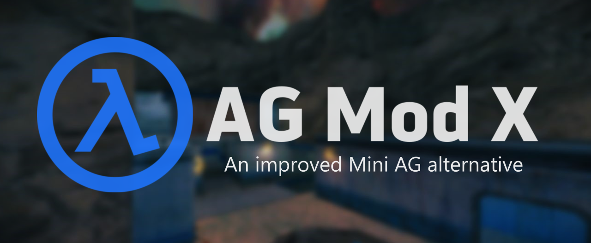

   

An improved Mini AG alternative developed as an AMX Mod X plugin from the ground up. It contains many bugfixes and improvements, and because it's open source it allows you to add new stuff and make improvements easily.

## ☰ Features

- **Bugfixes and Improvements:** The mod includes new commands and improvements to existing ones, with bug fixes and QoL changes in the gameplay through the use of Bugfixed HL in the core of the mod.
- **Portability and Flexibility:** The mod itself is an AMX Mod X plugin, allowing easy integration with other plugins on your server. You can easily disable the mod in case it conflicts with other plugins.
- **Multi-Language Support:** The mod supports translations of texts, menus and HUDs, with English and Spanish translations included out-of-the-box.
- **Open-Source:** The mod's source code is available, allowing you to add new features and make improvements with just basic programming knowledge.

## ☰ Improvements and fixes to the original Mini AG.

- HUD for messages and votes are now displayed with the AG Style. Colors can be customized too.
- Color codes are now displayed and no longer get removed. Most players already use clients that support coloring.
- Respawn time is now consistent with all FPS values (no more players spawning instantly by using high FPS).
- Fixed chat anti-flood muting the player indefinitely when the game is paused.
- No more bug of standing corpses from clients playing with high FPS. 
- Now you can use partial player names and without the need to include color codes for the next commands: `agallow`, `agkick`, `agforcespectator`, etc.
- Now you can vote for game mode and map simultaneously, saving you time by using  
  `vote <gamemode> [map]`. For example: `vote arena stalkx`.
- Added damage CVars for the crossbow and gauss secondary attack. Fixed hand grenade damage CVar too.
- Weapons are now displayed in spectator mode.
- Included more than 200 map locations (Thanks Golem).
- The `aglistvotes` and `help` commands now display across multiple pages, preventing disconnects due to commands overflow.

### Game modes

- Added **LLHL** game mode: Similar to EHLL, made for leagues/tournaments for fair competition.
- **Capture The Flag** mode is back! It wasn't available due to some limitations.
- Added **Arcade X:** Same as Arcade but now you start without armor, allowing for a more fast-paced gameplay.
- Fixed bolts fired from a previous match not being removed when a new duel starts in *Arena* mode.

More info about the new commands and features can be found in the [Docs](https://rtxa.github.io/agmodx/docs/getting-started/features).

## ☰ Requirements

- Pre-anniversary edition of HLDS (Build 8684) or latest [ReHLDS](https://github.com/dreamstalker/rehlds/releases) installed. 25th Anniversary compatibility hasn't been tested.
- [Metamod-P v1.21p38](https://github.com/jkivilin/metamod-p/releases) or newer (included and ready to use in the full package).
- [AMX Mod X 1.10 Build 5190](https://www.amxmodx.org/downloads-new.php) or newer (included and ready to use in the full package).

## ☰ How To Install

1. Have ready a clean installation of *Half-Life Dedicated Server*.
2. Download the *Full Mod Package* from [here](https://github.com/rtxa/agmodx/releases).
3. Extract the content into your server folder. Replace if asked.

Turn on your server and enjoy!

## ☰ Thanks to:

* **BulliT** for making AG and releasing the source code which was very helpful during development.
* **Lev** for making Bugfixed HL which includes many bug fixes and QoL improvements.
* **KORD_12.7** for his HL Stocks include for AMXX.
* **FlyingCat** for his LLHL game mode.

Please, feel free to report any issues or submit pull requests, any feedback will be appreciated.
