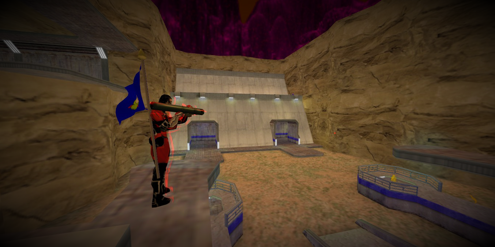

# Capture The Flag

Capture The Flag is a fun team-play game mode where two teams, Red and Blue, try to steal the other team's flag and bring it back to their own base to capture it.

Each team will have their own base and flag to defend. In order to score, your team's flag **must still be at your base**, which means you'll have to have some good defense to keep the other team from running off with your flag. If someone steals your team's flag, kill them and they'll drop it. Touch your team's flag and it will be returned to your base.

The team with most captures **wins**!

## Score system

- 4 points for each capture.
- 1 point for returning your team's flag.
- 1 point for killing the opponent that carries your flag.
- 1 point for stealing the other teams flag.
- 1 point if you kill your opponent close to your flag within a radius of 192 units.

## Client commands

* `dropitems` or `drop flag` — Drop flag in CTF mode.

## Server variables

- `sv_ag_ctf_flag_resettime 30` — The time that a dropped flag lays in the world before respawning.
- `sv_ag_ctf_capturelimit 10` — The number of captures before map ends. 
- `sv_ag_ctf_teamcapturepoints 1` — The ammount of points his teammates get 
- `sv_ag_ctf_capturepoints 4` — The amount of points the capturer gets 
- `sv_ag_ctf_returnpoints 1` — The amount of points the returner gets. 
- `sv_ag_ctf_carrierkillpoints 1` — The amount of points for killing the opponent that carries your flag.
- `sv_ag_ctf_stealpoints 1` — The amount of points the stealer gets. 
- `sv_ag_ctf_defendpoints 1` — The amount of points the defender gets. Enemy needs to be within a radius of 192 units.
- `sv_ag_ctf_roundbased 0` — Round-based game (start over at spawn when a team caps a flag).
