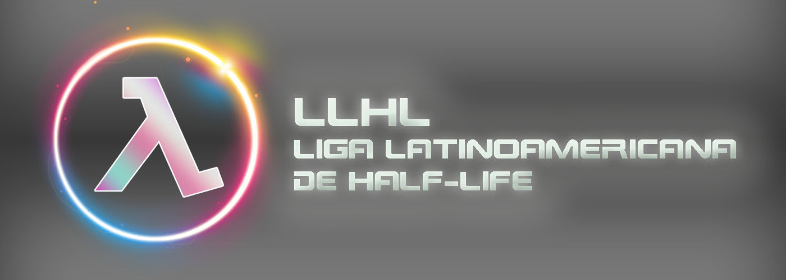

# LLHL

> LLHL stands for "Liga Latinoamericana de Half-Life"

LLHL is a game mode designed for the HL/AG community in Latin America for their own leagues and tournaments. This mode features functionality similar to the European game mode counterpart (EHLL mode).

## Features

**General**

- Automatic demo recording on match start.
- Unstuck command with 10-second cooldown.
- Ability to destroy other players satchels (Disabled by default).
- New intermission mode: Allows players to freely look around instead of being locked to a fixed angle.

**Fair-play**

- FPS Limiter (Maximum: 144 FPS).
- FOV Limiter (Minimum: 85 FOV, disabled by default).
- Block name and model changes when a match is on.

**Weapons**

- Egon damage reduced by 30%.
- Crowbar damage increased by 30%.
- Hornet gun damage increased by 60%.

**Fixes**

- RPG fix on: Avoids self-damage on rocket launch when moving at high speeds or closer to a wall.
- Gauss fix on: Disables self-gauss (Only first reflection).
- High-FPS respawn fix on: Ensures players respawn time is the same regardless of their FPS.

**Anti-Cheat Measures**

- Screenshots taken on death and when map ends.
- Check players are using default sounds for weapons, footsteps, etc.
- Simple OpenGF32 and AGFix cheat detection.

## Client commands

- `/unstuck` - Teleports you to a free spot in-case you're stuck (10-second cooldown).

## Server variables

**FPS limit**

- `sv_ag_fpslimit_max_fps 144`
- `sv_ag_fpslimit_max_detections 5`
- `sv_ag_fpslimit_check_interval 5.0`

**Unstuck**

- `sv_ag_unstuck_start_distance 32`
- `sv_ag_unstuck_max_attempts 64`
- `sv_ag_unstuck_cooldown 10.0`

**Satchel**
- `sv_ag_destroyable_satchel 0`
- `sv_ag_destroyable_satchel_hp 1`

**Checks**
- `sv_ag_check_soundfiles 1`
- `sv_ag_block_namechange_inmatch 1`