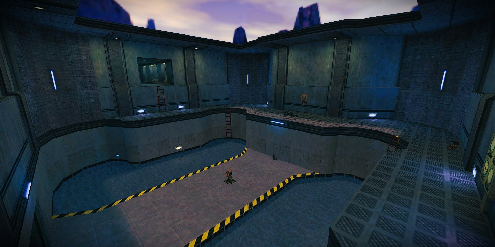

This page contains most of the features and bug fixes added to AG Mod X. Most of these come from using *Bugfixed HL*. 

## Highlights

- HUD for messages and votes are now displayed with the AG Style. Colors can be customized too.
- Color codes are now displayed and no longer get removed. Most players already use clients that support coloring.
- Respawn time is now consistent with all FPS values (no more players spawning instantly by using high FPS).
- Fixed chat anti-flood muting the player indefinitely when the game is paused.
- No more bug of standing corpses from clients playing with high FPS. 
- Now you can use partial player names and without the need to include color codes for the next commands: `agallow`, `agkick`, `agforcespectator`, etc.
- Now you can vote for game mode and map simultaneously, saving you time by using  
  `vote <gamemode> [map]`. For example: `vote arena stalkx`.
- Added damage CVars for the crossbow and gauss secondary attack. Fixed hand grenade damage CVar too. More info [here](/docs/guides/gamemodes.md#set-weapons-damage).
- Weapons are now displayed in spectator mode.
- Included more than 200 map locations (Thanks Golem).
- The `aglistvotes` and `help` commands now display across multiple pages, preventing disconnects due to commands overflow.

### Game modes

- Added **LLHL** game mode. Similar to EHLL. More info [here](/docs/getting-started/gamemodes/llhl.md).
- Added **CTF** mode back. It wasn't available due to some limitations. More info [here](/docs/getting-started/gamemodes/ctf.md).
- Added **Arcade X**. Same as Arcade but now you start without armor, allowing for a more fast-paced gameplay.
- **Arena:** Fixed bolts fired from a previous match not being removed when a new duel starts.

## Bugfixes

### Competitive

- Fixed players with high FPS respawning too fast. This ensures players respawn time is the same regardless of their FPS.
  - Added `mp_respawn_fix` and `mp_respawn_delay` with a default value of *0.95s* which is similar to spawning with 125fps.
- Fixed standing corpses bug from high FPS players.

### Quality of Life

- Fixed jittering when moving upwards on spectator mode.
- Fixed gauss charge sound not being reset when far away (Only on PAS). Still requires fixing on underwater, static discharge, etc.
- Fixed player killing from stationary weapons (like a turret) not being awarded points.
- Fixed getting stuck on lifts on high FPS servers for *CBaseToggle* objects, like `func_door`, `func_plat`, etc.
- Fixed non-stopping move sound if door was blocked and returned back. Instead of stopping the sound, just don't start a new one.
- Fixed Death Cam mode not working. Now players are able to nicely overlook the area after being death for more than 5 seconds.
- Fixed crash when using `give` on items not precached by the map: `weapon_satchel`, `item_healthkit` and `ammo_9mmbox`.
- Prevent `kill` command if client is already dead in spectator mode.
- Make dead players non-solid to remove jittering when passing over it.

### Exploits

- Fixed high network usage (choke) from bouncing satchels by disabling his animations. Satchel model didn't have animations anyway.
- Fixed server crash when a player tries to use a tank that was already being used by another player who had no weapons equipped.
- Fixed model name checking and diverse exploits:
  - Prevent client crash on malformed model name.
  - Check model name for forbidden characters like `<>:;%?*"|/\` or empty string.
  - Prevent usage of invisible models.
- Allow unstuck from a satchel, for example if player spawns on it.
- Deployed satchels are now removed on: death, disconnect, entering spectator mode and any other case where all weapons are stripped, even if not carrying satchels control (dropped after deploying).

### Chat

- Fixed anti-flood muting the player indefinitely when the game is paused. The cooldown wasn't being reset on pause for some reason.
- Fixed exploit when sending long messages with modifiers (`%L`, `%H`, `%A`, etc.), making players with older clients crash.
- Fixed chat flood control. Now it will check in burst mode: 3 messages within 0.5 sec with penalty of 2 seconds.
  
### Demo recording

- Fixed ammo counter not being updated when recording. Now `fullupdate` will resend `HideHUD`, `FOV`, `CurrentWeapon` and `Ammo` info. 
- Fixed `fullupdate` command exploit: Limit to no more than 2 commands within 5 seconds.

### Weapons

- Fixed repeating switching between **gauss** and **egon** when no ammo.
- Fixed fast repeating sound of empty reload of RPG on `+attack` holding.
- Fixed delay on primary attack with empty RPG launcher.
- Fixed RPG laser spot not hiding on reload.
- Fixed bug with crossbow bolt continuing to move after hitting some entity which doesn't take damage and explode in some other point.
- Fixed bug with tripmine big view model when weapon prediction is turned off.
- Fixed Egon and Gauss beam not coming out from weapon view model on spectator mode.
- Added missing player attack animation on primary shot from **shotgun**.
